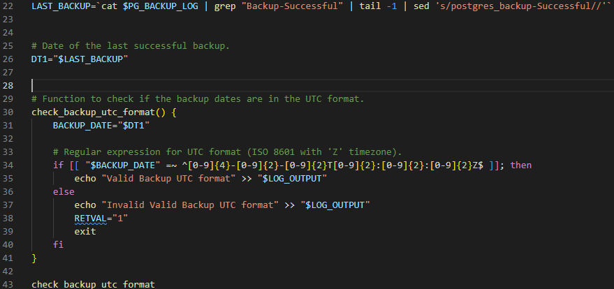
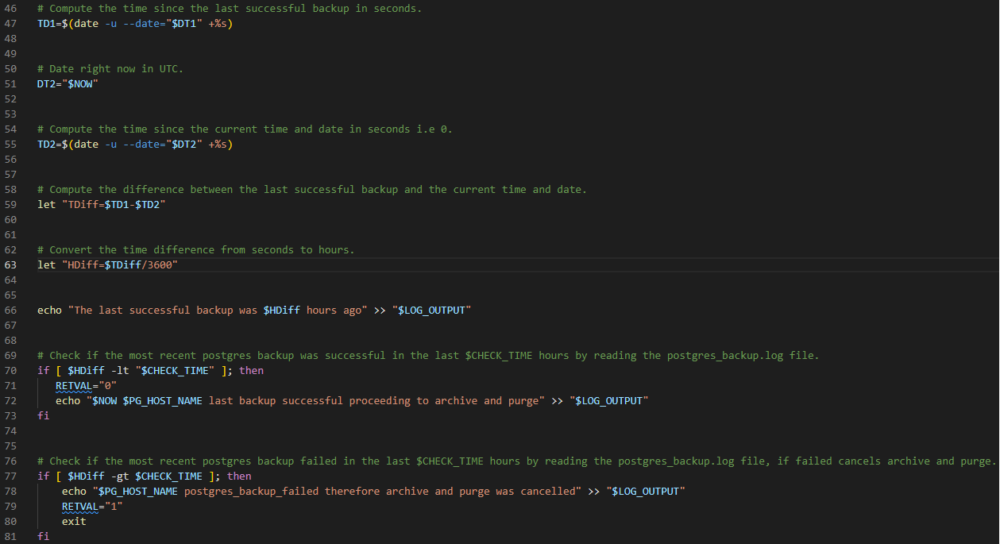
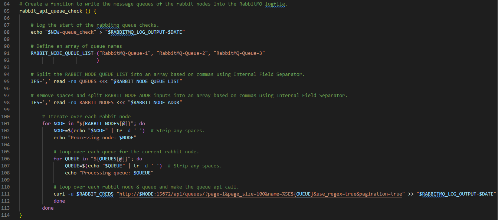
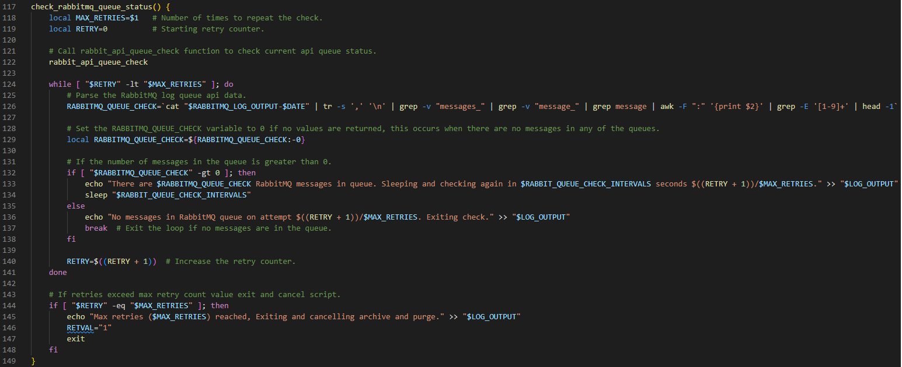
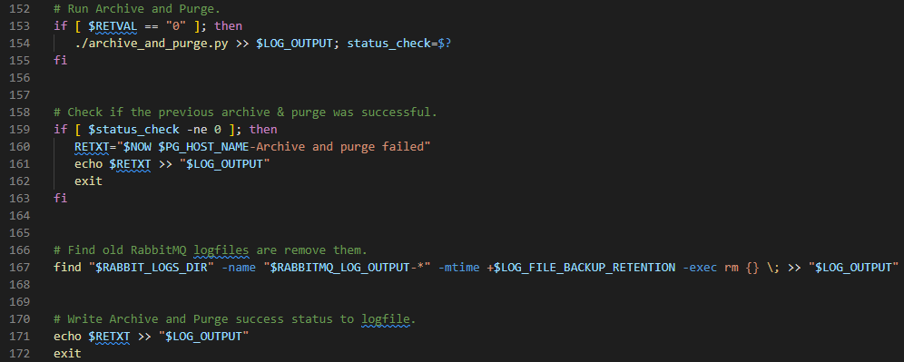
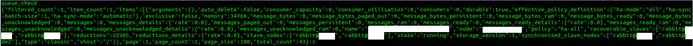
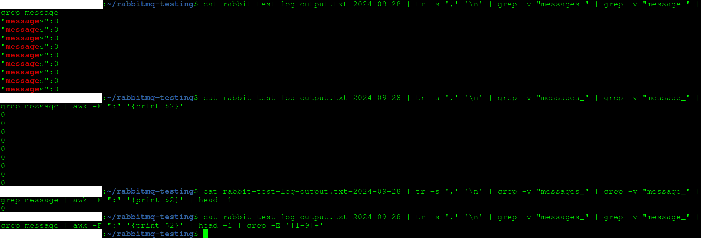
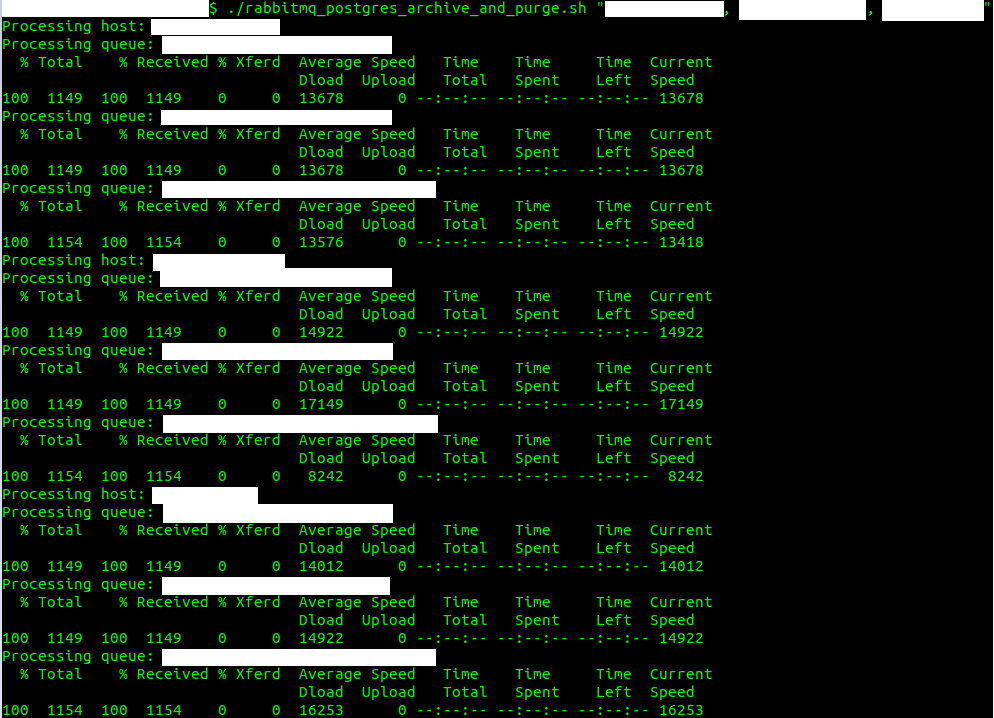

RabbitMQ Message Queue Bash Script is the result of my efforts to create a simple enough bash script to read and follow while also fulfilling its intended purpose for creation. 

The purpose was to create an automated method of checking if the RabbitMQ message queues have drained before continuing onto performing a postgreSQL archive and purge.    

 

<h1>The Scripts key requirements were the following:</h1>

• Check the last successful postgreSQL cluster backup. 
 
• Create logic to compare the current data/time to the last successful backup and only continue if it was in the last x hours.
 
• Automated, repeatable and idempotent method of checking the message status of every queue on the rabbitMQ Node/Nodes.
 
• Parse the complex queue message outputs to find out whether or not there was a single message in any of the queues on any of the nodes.   
• Have multiple message queue status checks because rabbitMQ queues can take a while to drain.  
• Detailed date/time stamped logging and command status checks.
 
• Log rotation of files stored outside of the /var/log.
 
 

<h1>PostgreSQL Backup Verification Logic </h1>

Define the LAST_BACKUP variable to check the postgreSQL log file for the last successful backup, create and run a function to check its in the correct UTC format.

 
 

Calculate the last successful backup in seconds, compare the time difference between the last backup and the current date/time first in seconds then in hours.
 
Calculate if the last successful backup happened in the last X number of hours, when TRUE continue script if FALSE exit script. 

 
 

<h1>RabbitMQ API Queue Data Retrieval Function</h1>

Create a function to loop over each rabbitmq node which inturn contains another loop to check each nodes defined api queues in the array for messages.
 
The node addresses are input via $5 argument, it can support one node address or many without limit for rabbitmq high availability clustering.

 
 

<h1>RabbitMQ Message Queue Data Parsing Function</h1>

Create a function to invoke the rabbitMQ api queue data retrieval function, then parse the generated api data for the amount of messages in each queue for each node.
 
If there are any messages in any of the queues in any of the rabbitmq nodes sleep and recheck $MAX_RETRIES number of times every $RABBIT_QUEUE_CHECK_INTERVALS number of seconds/minutes or hours.
 
 

 
 

<h1>PostgreSQL Archive & Purge/Log Rotation Logic</h1>

Logic to execute the postgreSQL archive & purge script if there are no messages in the rabitmq queues.
 
Logic to search for and delete old rabbitmq log files after a configurable amount of time with $LOG_FILE_BACKUP_RETENTION.

 
 

<h1>RabbitMQ Data Parsing Methodology</h1>

The data retrieved from the RabbitMQ API Queue Data Retrieval Function includes every data key seen below. 

 
 
Firstly, I'm only interested in the "messages":value key, therefore using various filters I narrow it down using | tr -s ',' '\n' | grep -v "messages" | grep -v "message" | grep message.
 
 
Second thing is to strip out just the message value so we can plug logic into it to determine what to do next using | awk -F ":" '{print $2}. 
 
 
The third thing is to narrow it down to 1 message queue value out of the many retrieved to simplify status checking using | head -1.     
 
Finally the last is to only parse message queue values above 0 so they can be plugged into logic to determines if the rabbitmq queues have drained.
 
 
During testing I encountered an error if the parsed message queue values were null the script would fail, to resolve this I added a line that set the local value of the variable RABBITMQ_QUEUE_CHECK to 0 if null was returned because there was no messages in the queues. 

local RABBITMQ_QUEUE_CHECK=${RABBITMQ_QUEUE_CHECK:-0}

 
 

<h1>Example Terminal Script Outputs</h1>

This following example includes 3 message queues per node and 3 rabbitmq nodes setup in an high availability configuration.   

 
 

<h1>Conclusion & Future Improvements</h1>

I believe this script is fit for purpose for single and multiple node rabbitmq clusters, ive optimized and debugged the code to the best of my current abilities and it seems quite configurable and resilient.
 
 
Future improvements would include strict variable input validation checks, though any operator error should cause the script to fail and not run archive and purge without verifying rabbitmq message queues.
 
 
Other improvements include adding support for multiple postgreSQL clusters as currently it only supports one and a breakdown of each message queue name and its message values per rabbitmq node for improved troubleshooting. 
